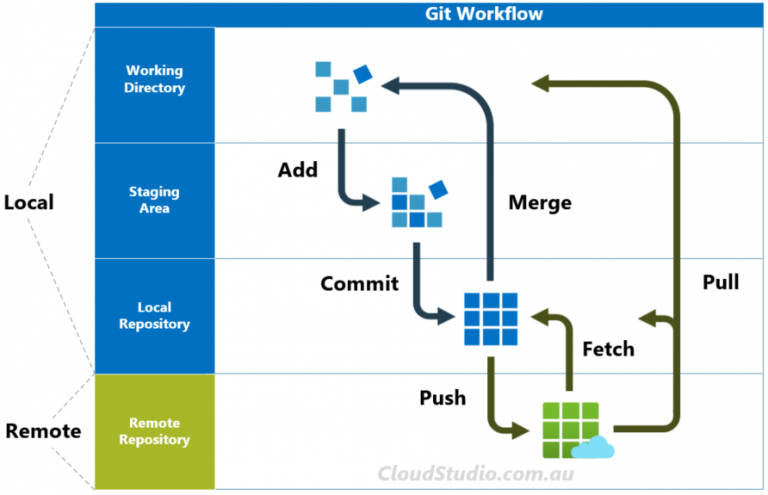

# Git and Github

- Basic commands
    
    ```jsx
    git config --global user.name {user name} <-- set username for git commits/ push globally
    git config --global user.email {email} <-- set user email for git commits/ push globally
    git init <-- for initializing git repo
    git status <-- get the status of git tracking files
    git add . <-- for adding everything in the folder to staging
    git commit -m "{comment}" <-- committing changes to local repository
    git commit -a -m "{commit}" <-- adds everything in the folder to staging and commits
    git log <-- show log of git commits
    ```
    
- Change default editor
    
    ```jsx
    git config core.editor {editor name} //e.g. git config core.editor notepad
    git log --oneline <-- shows only one line commit message for each commit
    
    ```
    
- Amending a commit
    
    ```jsx
    git commit --amend  //amends the **previous** commit only. Note that using this twice consecutively rolls back the **amend**
    ```
    
- **Ignoring files with .gitignore**
    - create a .gitignore file in the root of the repository, and add ignore patterns
        - .DS_store will ignore the file name .DS_store
        - folderName/  (slash is important) will ignore the directory folderName
        - *.txt will ignore files matching the pattern
- Branches
    
    ```jsx
    git branch // list branches
    git branch {branch-name} // add new branch
    git checkout {branch-name} // start working on new branch, move HEAD to branch-name
    git switch {branch-name} // same as checkout
    git switch -c {branch-name} // create a new branch and switch to it immediately
    git branch -d {branch-name} // delete branch branch-name, fails if it is not merged
    git branch -D {branch-name} // force delete branch-name, doesn't care if unmerged
    git branch -m {new-branch-name} // renames current branch to new-branch-name, use -M to force
    git branch -r //show remote tracking branch - a reference to the state of the master branch in the remote host
    git switch {remote-branch-name} //creates new local branch from the remote branch of the same name
    ```
    
- Merging Branches
    
    ```jsx
    git switch {receiving-branch}
    git merge {merged-branch}
    
    ```
    
- Git Diff
    
    ```jsx
    git diff //shows diff between unstaged files only
    git diff <commit ID 1> <commit ID 2> //shows diff between 2 commits
    git diff HEAD //diff between HEAD and working directory
    git diff --staged //diff between files in staging/ cache only
    git diff --cached //diff between files in staging/ cache only
    git diff HEAD {filename} //diff only for a file
    git diff {branch1} {branch2} //diff between all files in the 2 branches
    git diff {tag1} {tag2} //diff 2 tags
    ```
    
    ```jsx
    **SAMPLE DIFF OUTPUT**
    diff --git a/songs.txt b/songs.txt  <-- file name markers a and b
    index e69de29..5856be8 100644
    --- a/songs.txt                     <-- in diff, "-" is for a, and "+" is for b
    +++ b/songs.txt
    @@ -0,0 +1,3 @@           <--chunk header. "0 lines starting from 0 extracted                                  from a", 3 lines starting from line 1 extracted from b
    +song 1: SOS - ABBA
    
    ```
    
- Git Stash
    
    ```jsx
    git stash //keeps changed files in stash without adding to staging/ cache
    git stash pop //pops the last stashed items back to the currently active branch, and removes it from the stash
    git stash apply //moves the last stashed items back to the currently active branch, and DOES NOT remove it from the stash. The same can be added to subsequent active branches
    git stash list //lists the stashed versions
    git stash apply <version identifier> //adds back the specified stashed version to the current active branch
    ```
    
- Git restore, reset, revert
    
    ```jsx
    git checkout <commit hash> //checkout (move head to) the specified commit hash. detaches head
    ***NOTE: HEAD usually points to a particular Branch reference, like **main*****
    ***NOTE: Branch reference points to a commit within the branch***
    ***Detached HEAD however refers to a particular commit***
    git switch <branchname> //will move head back to the selected branch, basically undoing head detachment
    git switch - //will move to the branch previously on
    git checkout HEAD~1 //will move to previous commit
    git checkout HEAD~2 //will move to 2 commits before current HEAD position
    git checkout "<tag-name>" //checkout the tagged commit hash in detached Head mode
    
    ***Undoing changes made to file(s)***
    git checkout HEAD <filename 1> <filename 2> //reverts uncommitted changes to last HEAD
    git checkout -- <filename 1> <filename 2> //same effect
    git restore <filename> //reverts changes to file, same as git checkout HEAD <filename>
    git restore --source HEAD~3 <filename> //reverts uncommitted file changes to Head-3
    git restore --source <commit-hash> <filename> //reverts uncommitted file changes to specified commit hash
    git restore --staged <filename> //removes filename from git staging and commits, but file is still tracked
    
    git reset <commit-hash> //undo commits and revert repo to the specified commit hash. But files are not changed, and changes become uncommitted changes
    git reset --hard <commit-hash> //undo commit, revert repo, **and get rid of changes**
    
    git revert <commit-hash>  //create a fresh commit that removes the changes and saves the reverted files as a new commit. Thus history is preserved
    ****
    ```
    
- github
    
    ```jsx
    git clone {repository-url} //clone a repository to local folder, with a new folder created as a subfolder
    git clone {repository-url} . //clone repository to current working folder without creating a new folder
    git remote //shows a list of remotes, add -v for verbose
    git remote add <name> <url> //git remember this url under this name
    git remote remove <name> //remove the named remote
    git remote rename <old-name> <new-name> //change the name of a remote
    git push <remote-name> <local-branch-name> //push local branch to remote
    git push -u <remote-name> <local-branch-name> //Push local branch and remember that its remote home is origin.
    git push <remote-name> <local-branch>:<remote-branch> //push specified local branch to specified branch in the remote
    git clone <url> //clones remote repository to local filesystem
    
    ```
    
- git fetch vs pull
    
    
    
    ```jsx
    git fetch <remote> //fetch branches from remote to local repository (not working directory)
    git fetch <remote> <branch> //fetch specific branch from remote
    git pull <remote> <branch> //fetches to local repo and updates working directory, in the current local branch
    ```
    
- Rebasing
    
    ```jsx
    git rebase <source-branch-name> //rebases current branch on the tip of the source branch. need to switch to destination branch before running rebase
    git rebase --abort //abort rebase in case of conflicts, and revert to state before rebase start
    git rebase -i HEAD~4 // interactive rebase. allows to edit commits, add files, drop commits etc. on current branch. must specify how far back we want to go
    ```
    
    - git rebase is an alternative for merging. can also be used to cleanup git history.
    - 
- Git Tags
    - lightweight tags vs annotated tags: The latter has addition meta data included, e.g. author email, date etc
    - tags do not automatically get pushed to remote
    
    ```jsx
    git tag "<text>" <commit-id> //tags commit id with the text tag (lightweight tag)
    git tag -d "<tag-name>" //deletes tag across all commits, without touching actual commits
    git tag //list all tags
    git tag -l "<pattern>" //search for tags matching the pattern, e.g. "*beta*"
    git tag <tagname> //create new tag, default points to the HEAD
    git tag -a <tagname> //create an annotated tag
    git tag -am <tagname> //creates annotated tag without opening text editor
    git show <tagname> //show details on the tag
    git tag <tagname> <commit-hash> -f //forces a move of an existing tag to a different commit hash
    git push <remote-name> <tag-name> //push signle tag to remote
    git push <remote-name> --tags //push all tags
    ```
    
- git config
    - local config is located in the .git directory in a repo
    
    ```jsx
    git config <parameter> <value> //edits global config file
    git config --local <parameter> <value> //edits local config file
     
    ```
    
- git trees, blobs, commits
    
    ```jsx
    git cat-file -p <hash> //pretty print (-p) object represented by hash
    git hash-object <filename> //hashes file using SHA1, but does not store it
    git hash-object <filename> -w //hashes file and stores as an object in .git/objects directory, with first 2 characters of the hash translated to sub-directory name, and the remaining characters translated to the object name
    echo "hi" | git hash-object --stdin //hashes output from stdin
    echo "hi" | git hash-object --stdin -w //hashes and stores as an object (BLOB)
    git cat-file -p <branch-name>^{tree} //shows tree of specified branch
    git cat-file -t <hash> //shows type of hash - tree/ blob etc.
    git cat-file -p <commit-hash> //shows details of the specified commit
    ```
    
    - Blob: object type (binary large object) git uses to store the content of files in a repository. Filename is excluded. Each blob gets its own hash.
    - Tree: object type git uses to store the contents of a directory. Trees contain pointers/ hashes referring to blobs and to other trees, and file and directory names linked to each
        
        
        
    - Commit: object that contains a tree object along with reference to parent commit, the author, the committer and the commit message
        
        
        
- git Reflog
    - NOTE: Reflogs are **LOCAL** only, and expire in 90 days by default
    - git reflog output has relative reference of where a branch head was “x” moves ago, e.g. **HEAD@{2}**
        - Note that HEAD@{2} is different from HEAD~2: The latter is applicable for commits only (2 generations of past commits), while the former is based on any action done locally
    
    ```jsx
    git reflog show <reference> // show reflog for reference - HEAD, Branch etc
    git checkout HEAD@{<number>} //detach HEAD to specific reflogged head reference
    ```
    
    - ***<reference>@{<number>}*** can be a Branch, HEAD, etc with the <number> being a number (number of reflogged steps to go back), or date/ time like
        - 1.day.ago
        - 3.minutes.ago
        - yesterday
        - Fri, 6 Feb 2026 14:06:21 -0800
    - these references for reflogged entries can be passed around to other commands, like git diff